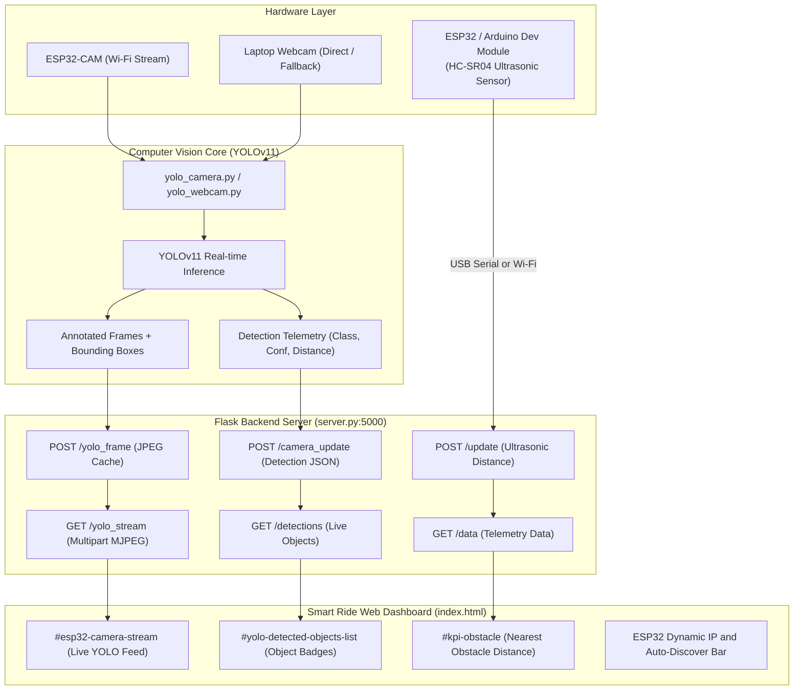

# Smart Ride — Intelligent Autonomous Wheelchair Mobility OS

[](https://python.org)
[](https://flask.palletsprojects.com/)
[](https://github.com/ultralytics/ultralytics)
[](https://tailwindcss.com/)
[](https://espressif.com/)

**Smart Ride** is an intelligent electric wheelchair mobility operating system integrating **Edge AI Computer Vision (YOLOv11)**, **ESP32-CAM video streaming**, **Ultrasonic Distance Telemetry**, **Flask Backend API**, and a modern **Web Dashboard**.

---

## Architecture & Data Flow



---

## Key Features

1. **Integrated YOLOv11 Computer Vision**:
   - Real-time object detection with bounding boxes, class labels, confidence scores, and scale-based proximity estimation.
   - Streamed seamlessly to the web interface with low latency.

2. **Dual-Camera System with Auto-Failover & Auto-Discovery**:
   - **ESP32-CAM Connection**: Connects via high-speed threaded MJPEG stream parser (`ESP32StreamCapture`).
   - **Subnet Auto-Discovery**: Automatically scans local Wi-Fi subnets in ~1s to detect changed ESP32 DHCP IP addresses.
   - **Laptop Webcam Mode**: Dedicated standalone direct webcam streamer (`yolo_webcam.py`) or flag (`--webcam`).
   - **Zero Downtime**: Seamlessly shifts to laptop webcam if ESP32-CAM disconnects.

3. **Live Ultrasonic Distance Telemetry**:
   - Connects to ESP32 / Arduino reading HC-SR04 ultrasonic sensor.
   - **USB Serial Bridge (`esp_serial_reader.py`)**: Auto-detects COM port and sends real-time obstacle distance in `cm`.
   - **Interactive Terminal Simulator**: Allows manual distance input or automated simulation.
   - Updates the **NEAREST OBSTACLE** card in the Central Telemetry Dashboard (color-coded green, amber, blinking red).

4. **Web Dashboard & Subsystems**:
   - **Central Telemetry Dashboard**: Real-time vehicle diagnostics, speed, battery BMS, gyro compass, and 360 radar sweep.
   - **Camera Section**: Live annotated video stream, spatial HUD brackets, distance metric tags, and live identified objects table.
   - **Dynamic IP Controller**: In-browser IP manager with manual override and one-click auto-discovery.

---

## Repository File Structure

```
Project-Smart-Wheel-Chair-/
├── index.html                   # Single Page Application Web Dashboard
├── server.py                    # Flask Backend Server (Port 5000)
├── esp_serial_reader.py         # USB Serial & Terminal Ultrasonic Bridge
├── esp32_ultrasonic.ino         # Arduino IDE Firmware for HC-SR04 Sensor
├── yolo_webcam.py               # Dedicated Direct Laptop Webcam YOLO Streamer
├── yolo_camera.py.py            # ESP32-CAM + Auto-Discovery + Webcam Failover
├── yolo.py                      # Secondary YOLO Streamer Script
├── capture_dataset.py.py        # Dataset Collection Utility
├── RUN_SMART_RIDE.txt           # Quick execution instructions
├── README.md                    # Project documentation
│
├── vision/                      # Computer Vision Subsystem Package
│   ├── yolo_camera.py.py
│   ├── yolo_webcam.py
│   ├── yolo.py
│   └── capture_dataset.py.py
│
├── assets/                      # Frontend Subsystem Modules
│   ├── js/
│   │   ├── app.js               # Application router & view switcher
│   │   ├── camera-system.js     # Camera HUD, YOLO box rendering & IP controls
│   │   ├── network-bridge.js    # Telemetry & YOLO detection sync bridge
│   │   ├── dashboard.js         # Central Telemetry Dashboard & radar canvas
│   │   ├── battery-bms.js       # Battery Management System monitor
│   │   ├── map-nav.js           # GPS mapping & route navigation
│   │   ├── voice-command.js     # Web Speech API voice control
│   │   ├── auth.js              # Identity & operator profile manager
│   │   └── fluid-gesture.js     # Fluid touch & gesture engine
│   └── css/                     # Custom stylesheets
│
├── GESTURE CODE/                # Microcontroller gesture navigation code
└── wheelchair-nav/              # Autonomous navigation modules
```

---

## Hardware Wiring & Pinout Guide

### 1. HC-SR04 Ultrasonic Sensor with ESP32 Dev Module
| HC-SR04 Pin | ESP32 Pin | Arduino Uno / Nano Pin | Description |
|:---|:---|:---|:---|
| **VCC** | `5V` (or `VIN`) | `5V` | Power Supply |
| **GND** | `GND` | `GND` | Ground |
| **TRIG** | `GPIO 5` | `Pin 9` | Trigger Pulse Input |
| **ECHO** | `GPIO 18` | `Pin 10` | Echo Pulse Output |

### 2. ESP32-CAM Module
- **Power**: 5V / 2A external power supply.
- **Default Stream URL**: `http://<ESP32_IP>/stream` (e.g. `http://10.228.132.35/stream`).

---

## Quick-Start Guide

### Step 1: Start the Flask Backend Server
```powershell
python server.py
```
*Access the web dashboard in your browser at `http://127.0.0.1:5000`.*

### Step 2: Start the YOLO Object Detection Streamer
- **Option A (Direct Laptop Webcam)**:
  ```powershell
  python yolo_webcam.py
  ```
- **Option B (ESP32-CAM with Auto-Discovery)**:
  ```powershell
  python yolo_camera.py.py
  ```

### Step 3: Stream Ultrasonic Sensor Data to Telemetry Tab
- **Option A (Read Live from ESP32 USB Serial)**:
  ```powershell
  python esp_serial_reader.py
  ```
- **Option B (Interactive Terminal Input / Simulation)**:
  ```powershell
  python esp_serial_reader.py --simulate
  ```

---

## API Endpoints Reference

| Endpoint | Method | Description |
|:---|:---|:---|
| `/` | `GET` | Serves main Web Dashboard (`index.html`) |
| `/yolo_stream` | `GET` | Multipart MJPEG live video stream with YOLO bounding boxes |
| `/yolo_frame` | `POST` | Receives annotated binary JPEG frames from YOLO script |
| `/camera_update`| `POST` | Receives structured object detection JSON metadata |
| `/detections` | `GET` | Returns active YOLO detections, count, and status |
| `/update` | `GET / POST` | Updates telemetry data (distance in cm, GPS, speed, battery) |
| `/data` | `GET` | Returns current wheelchair telemetry JSON |
| `/get_camera_ip`| `GET` | Returns current active ESP32-CAM IP & camera source |
| `/set_camera_ip`| `POST` | Dynamically updates the active camera IP |
| `/scan_camera_ip`| `POST`| Triggers high-speed subnet scan for ESP32-CAM |
| `/health` | `GET` | Health check endpoint |